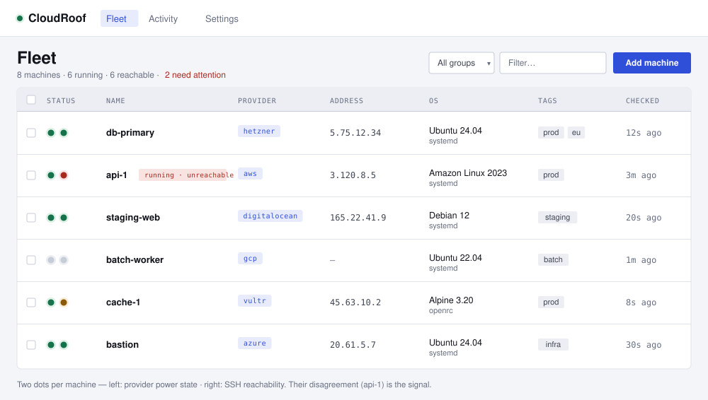
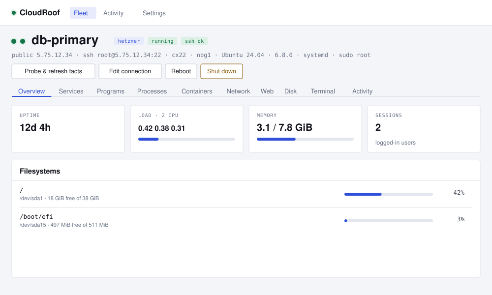
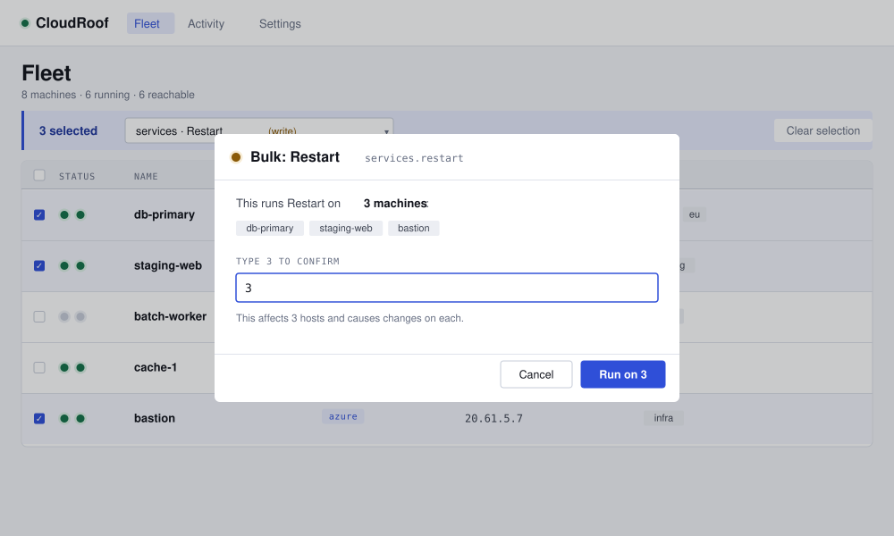
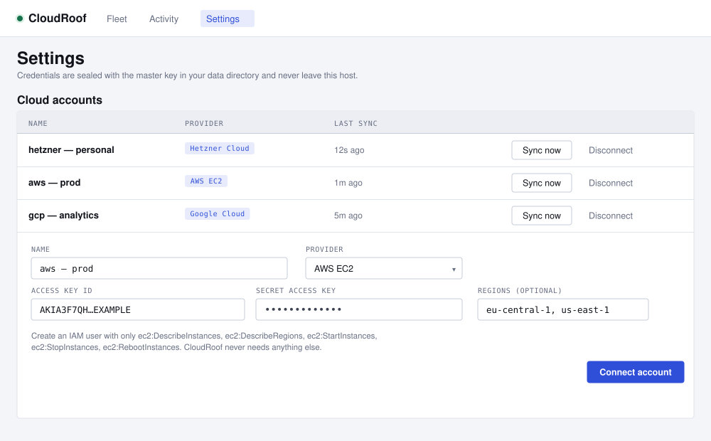

# CloudRoof

One self-hosted dashboard for every Linux machine you own, across every cloud
you rent from — power control from the provider API, and a button layer over
the commands you keep re-typing through SSH.

Nothing is installed on your machines. No credential leaves your box.

> This repository is a fork of
> [mohitsolanki026/cloudroof](https://github.com/mohitsolanki026/cloudroof)
> (v1.5.1), continued with the improvements listed under
> [Roadmap](#roadmap).

**With Go** — installs the full binary, web UI bundled:

```
go install github.com/Sohit-projects/cloudroof/cmd/cloudroof@latest
~/go/bin/cloudroof        # go install puts the binary in $(go env GOPATH)/bin
```

To launch it as just `cloudroof`, put Go's bin directory on your PATH (append
to `~/.bashrc` to make it stick):

```
export PATH="$PATH:$(go env GOPATH)/bin"
```

**Or build from source:**

```
git clone https://github.com/Sohit-projects/cloudroof
cd cloudroof && make web && make build && ./bin/cloudroof
```

Then open http://localhost:7070. This fork does not publish prebuilt binaries
yet; the original v1.5.1 binaries are on the upstream
[releases](https://github.com/mohitsolanki026/cloudroof/releases) page.

## Screenshots

The whole fleet in one view — every machine across six clouds, each with the
two status dots (left: provider power state · right: SSH reachability):



A single machine's operations surface — a live overview, with tabs for
services, containers, network, disk, and a real terminal:



Run one action across many machines at once — the confirmation escalates to
typing the number of affected hosts, after a preview that names every one:



Connect a cloud account — the form is generated from each provider's spec, so
adding a provider needs no UI work:



<sub>Interface previews, faithful to the actual UI.</sub>

## What it does

- **Fleet view** — every machine across every provider in one list, with two
  status dots: what the cloud says (running / stopped) and what SSH saw
  (reachable / refused / timeout / auth failed). Their disagreement is the
  signal. Reachability refreshes on its own, so the dots stay honest.
- **Power** — start, shut down, reboot, force-stop, force-reboot via the
  provider API. For when SSH is dead.
- **Overview** — uptime, load, memory, filesystems, sessions, reboot-required.
  One batched probe per refresh.
- **Services** — systemd units with start / stop / restart, a journal
  snapshot, and a live `journalctl -f` follow.
- **Programs** — supervisor programs with start / stop / restart and a live
  `tail -f`.
- **Processes** — top by CPU with TERM / KILL.
- **Containers** — Docker containers with start / stop / restart, live
  `docker logs -f`, disk usage, and prune.
- **Network** — listening ports and established connections mapped to the
  owning process, plus a reach-a-URL probe run from the host.
- **Web** — nginx config test and gated reload, and a TLS certificate expiry
  check for any host:port.
- **Disk** — largest directories, inode usage, journal vacuum, apt cache clean.
- **Terminal** — a real shell on the pooled SSH connection.
- **Activity** — every command CloudRoof has ever run, with output, append-only.

Tabs are drawn from what each host actually has: a box without Docker never
shows a Containers tab, one without systemd never shows Services.

### Fleet operations

- **Groups** — a named set of tags; a machine belongs when it carries all of
  them, resolved live so membership tracks the fleet as tags change.
- **Bulk actions** — select machines (or a group) and run one action across
  all of them. Confirmation escalates: a read needs a click, a write makes you
  type the number of affected hosts after a preview that names them. Each host
  is gated, sudo-decided, and audited individually; you get a per-host result.
- **Custom actions** — save your own command as a button, with named params
  (shell-quoted), a declared danger tier the gate enforces, and optional
  capability requirements. Tier 3 is refused; destructive one-offs belong in
  the terminal.

## Providers

Hetzner Cloud, DigitalOcean, AWS EC2, Azure, Google Cloud, and Vultr. Each needs only
read + power permissions, and the account form tells you exactly which:

- **Hetzner / DigitalOcean** — an API token.
- **AWS** — an access key pair; scans the regions you name, or all of them.
- **Azure** — a service principal (subscription + tenant + client id/secret).
- **Google Cloud** — a service-account JSON key; scans the projects you name,
  or the key's own project.
- **Vultr** — an API key.

Machines that are not on a supported provider (bare metal, a Pi, a provider we
don't speak yet) work fine — add them by SSH and you get everything except
power control.

### Slim builds

The AWS, Azure, and GCP SDKs are large; including all six providers makes a
~59 MB binary. Hetzner, DigitalOcean, and Vultr are plain REST/token clients
with no SDK, so a build with just those is ~16 MB. Providers are opt-out at
build time:

```
make slim                              # drops AWS + Azure + GCP (~16 MB)
go build -tags "noaws noazure" ./cmd/cloudroof   # any combination
```

Tags: `nohetzner nodo novultr noaws noazure nogcp`. A provider compiled out
simply never registers, and its account type doesn't appear in the UI.

## Safety

Every action carries a tier. Tier 0 runs on click. Tier 1 asks once. Tier 2
makes you type the machine's name. Tier 3 — `rm -rf`, `mkfs`, terminate — does
not exist as a button and never will.

Every button shows the exact command before it runs and logs it after. Actions
that need root use passwordless `sudo -n` where the host allows it and are
disabled, never left to hang on a prompt, where it doesn't.

## Network exposure

There is no login yet. CloudRoof therefore binds to `127.0.0.1:7070` by default,
refuses requests whose `Host` header is not itself (DNS rebinding), and refuses
cross-origin browser requests (CSRF). To reach it from another machine, opt in
explicitly and name the hosts you will use:

```
cloudroof -addr 0.0.0.0:7070 -hosts cloudroof.lan,10.0.0.5
docker build -t cloudroof .
docker run -d -p 7070:7070 -e CLOUDROOF_HOSTS=cloudroof.lan -v cloudroof:/data cloudroof
```

Binding a network address without `-hosts` works but accepts any `Host` and
logs a warning at startup. Put CloudRoof behind a reverse proxy that adds
authentication and TLS before exposing it beyond a trusted network. Multi-user
auth is on the roadmap.

## Development

```
make dev              # Go backend on :7070, serving web/dist from disk
cd web && npm run dev # Vite on :5173 with /api proxied to :7070
make test             # go vet + unit tests (parsers, catalog, keyring)
make e2e              # full stack against a throwaway local sshd
make release          # cross-compiled tarballs + checksums in dist/
```

See `.agents/README.md` for the architecture brief and invariants.

## Status

v1.5. Six providers (Hetzner, DigitalOcean, AWS, Azure, GCP, Vultr); the
systemd / supervisor / docker / nginx catalog; live log streaming;
self-refreshing reachability; tag-based groups, bulk actions, and saved custom
actions; single admin user; one-command install. No metrics history yet, and
no multi-user — those are later milestones.

## Roadmap

Planned work for this fork, roughly in order.

**Fixes**

- [ ] Docker build: the build stage uses `golang:1.22`, but `go.mod` requires
      Go 1.26, so `docker build` fails.
- [ ] Machine page: when a host is unreachable, a tab re-runs its action in a
      loop, toasting an error and writing an audit row each time.
- [ ] Log follow: closing a quiet `journalctl -f` / `docker logs -f` leaves
      its SSH session open until the next log line arrives.
- [ ] AWS / GCP: after a stop/start, `ssh_host` stops following the new public
      IP because the stopped instance reported an empty one.
- [ ] Frontend error handling: Activity can hang on "Loading…", Settings
      deletes fail silently, and empty error bodies show an empty toast.

**Security**

- [ ] Docker default (`CLOUDROOF_ADDR=:7070`) accepts any `Host` header; keep
      the DNS-rebinding check on.
- [ ] Security headers (`frame-ancestors`, CSP, `nosniff`).
- [ ] Self-host the web fonts instead of loading them from Google.
- [ ] Built-in login (single admin password + session cookie).

**Tooling**

- [ ] CI: `go vet`, `go test -race`, frontend build, and a check that the
      committed `web/dist/` is up to date.
- [ ] ESLint + frontend unit tests.
- [ ] Tests for `internal/api`, `internal/sshx`, `internal/facts`, and the
      providers.
- [ ] Split `web/src/pages/Machine.tsx` (~1,500 lines) into one file per tab.

**Features**

- [ ] Delete / rename / re-tag machines from the UI.
- [ ] Activity filters (machine, action, failed only) and pagination.
- [ ] "Run on group" in the bulk dialog.
- [ ] `netstat` and BusyBox `ps` fallbacks.
- [ ] Audit log retention.
- [ ] Metrics history with sparklines.
- [ ] Notifications (webhook / ntfy / Slack) on reachability and power changes.
- [ ] SSH jump host / bastion support.
- [ ] Mobile layout and keyboard / screen-reader accessibility.

## License

CloudRoof is licensed under the **GNU Affero General Public License v3.0 only**
(AGPL-3.0-only) — see [LICENSE](LICENSE). In short: you may run, study, modify,
and share it freely, but if you modify it and offer it to others over a network,
you must offer them your modified source too.

Originally written by
[mohitsolanki026](https://github.com/mohitsolanki026/cloudroof); this fork
keeps the same license.

A separate **commercial license** is available for organizations that cannot use
AGPL software — contact the maintainer.
